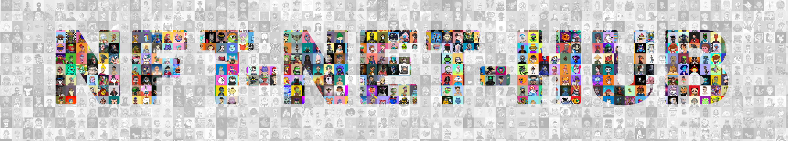
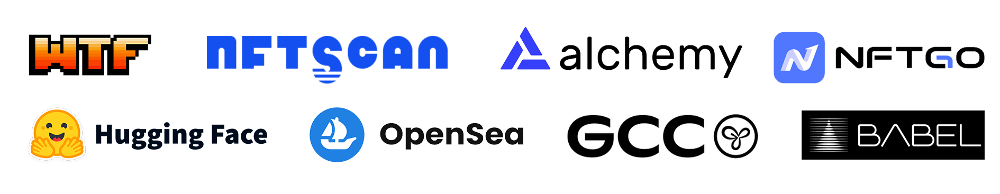

## <div align="center">NFT-NET-HUB: NFT-NET 数据集的综合管理工具</div>

[](https://huggingface.co/datasets/shuxunoo/NFT-Net)[](https://arxiv.org/abs/2402.16872)[](https://github.com/ShuxunoO/NFT-NET-Hub/issues)[](https://github.com/ShuxunoO/NFT-NET-Hub/issues)

[English Version](README.md) | [中文版](README_ZH.md)

<br>

## 🚀- 新闻

- [2024-10-15] ⛵ 项目创建；

- [2023-10-25] 🥳 NFT-NET-Hub for [NFT1000](https://huggingface.co/datasets/shuxunoo/NFT-Net/tree/main/NFT1000) 发布！🎉；

- ……

<br>

## 📋︎- NFT-NET-HUB 介绍

**NFT-NET-HUB** 是一个多功能且用户友好的包管理工具，专为 NFT-NET 数据集设计。它提供了一种高度灵活和高效的方式来查询、下载和管理 NFT-NET 中的数据，确保开发人员和研究人员在处理 NFT 数据集时的无缝集成和可用性。

**NFT-NET-HUB** 的主要功能包括：

- **数据查询**：轻松搜索 NFT-NET 数据集以找到所需数据；
- **数据下载**：方便地从云端以结构化格式下载 NFT 数据；
- **数据管理**：轻松组织、维护和跟踪您的 NFT 数据集合；

无论您是为了研究还是开发而探索 NFT 数据集，**NFT-NET-HUB** 都能简化整个过程，使其成为处理 NFT 数据的必备工具。

<br>

## ⚙- 使用方法

### 1. 下载和安装

克隆 Github 仓库。

   ```git
   git clone https://github.com/ShuxunoO/NFT-NET-Hub.git
   ```

安装依赖。
       
```bash
cd NFT-NET-Hub
pip install -r requirements.txt
```

如果你使用 Conda, 运行
```

conda env create -f environment.yml

```


### 2. 下载目标 NFT 项目

支持断点续传，**请确保您可以访问 Huggingface**🪜

```
cd NFT-NET-Hub/nft_net_hub
```

修改 `download.py` 文件以下载您想要的 NFT 项目。
<br>

   ```python
   
   from utils.downloader import NFT1000
   
   local_repo_path = "absolute/path/to/local/repo"
   # 修改 NFT_name_list 为您想要下载的 NFT 项目
   NFT_name_list = ["BoredApeYachtClub", "CRYPTOPUNKS"]
   
   NFT1000 = NFT1000("NFT1000", local_repo_path)
   NFT1000.download(NFT_name_list)
   
   ```

   <br>

   🤔 有时您可能记不清 NFT 项目的具体名称……

   不用担心，NFT-NET-HUB 可以给您一些建议，例如：

   ```python
   
   from utils.downloader import NFT1000
   
   local_repo_path = "absolute/path/to/local/repo"
   NFT1000 = NFT1000("NFT1000", local_repo_path)
   NFT1000.download(["BoredApe"])
   
   # Error: BoredApe not in repo_info, do you mean [('DAPE', 0.67), ('BoredApeYachtClub', 0.64), ('BoredApeKennelClub', 0.62)]?
   
   ```

   或

   ```python
   
   from utils.downloader import NFT1000
   
   local_repo_path = "absolute/path/to/local/repo"
   NFT1000 = NFT1000("NFT1000", local_repo_path)
   NFT1000.query("BoredApe")
   
   # Error: BoredApe not in repo_info, do you mean [('DAPE', 0.67), ('BoredApeYachtClub', 0.64), ('BoredApeKennelClub', 0.62)]?
   
   ```

   或

   ```python
   
   from utils.downloader import NFT1000
   local_repo_path = "absolute/path/to/local/repo"
   
   NFT1000 = NFT1000("NFT1000", local_repo_path)
   print(NFT1000.get_NFT_name_list())
   # ['BoredApeYachtClub', 'CRYPTOPUNKS', 'MutantApeYachtClub', 'Azuki', 'CloneX', 'Moonbirds', 'Doodles',……]
   
   ```

<br>

👋 如果您想下载所有 NFT 项目，只需：
   ```python
   
   from utils.downloader import NFT1000
   local_repo_path = "absolute/path/to/local/repo"
   
   NFT1000 = NFT1000("NFT1000", local_repo_path)
   NFT1000.download_all()
   
   ```

但请注意，这可能需要很长时间，因此请确保您的网络连接稳定且快速🚀

<br>

### 3. 解压 NFT 项目

NFT1000 数据集中的项目都以 **.zip** 格式存储。下载完所需项目后，您可以使用 NFT-NET-HUB 包提供的工具轻松解压。以下是如何操作的示例：

```python
from utils.downloader import NFT1000
local_repo_path = "absolute/path/to/local/repo"
NFT1000 = NFT1000("NFT1000", local_repo_path)

NFT_name_list = ["BoredApeYachtClub", "CRYPTOPUNKS"]

NFT1000.unzip(NFT_name_list)
```

<br>

👋 如果您想解压所有 NFT 项目，只需：

```python

from utils.downloader import NFT1000
local_repo_path = "absolute/path/to/local/repo"

NFT1000 = NFT1000("NFT1000", local_repo_path)
NFT1000.unzip_all()

```

<br>

### 4. 查询

查询特定 NFT 项目的信息。

   ```python
   
   from utils.downloader import NFT1000
   
   local_repo_path = "absolute/path/to/local/repo"
   NFT1000 = NFT1000("NFT1000", local_repo_path)
   print(NFT1000.query("BoredApeYachtClub"))
   
   # {'project_name': 'BoredApeYachtClub', 'contract_address': '0xbc4ca0eda7647a8ab7c2061c2e118a18a936f13d', 'total_supply': 10000, 'actual_collected_quantity': 10000, 'description': 'The [Bored Ape Yacht Club](https://boredapeyachtclub.com/) NFTs are a collection of 10,000 unique Bored Ape Non Fungible Tokens. A Bored Ape serves as your access to the Yacht Club, and gives access to many members-only features, the first of which is access to THE BATHROOM, a collaborative graffiti board. BAYC is one of many NFT collections by Yuga Labs and has quickly become a cultural phenomenon. ', 'official_url': 'http://www.boredapeyachtclub.com/', 'opensea_url': 'https://opensea.io/collection/boredapeyachtclub', 'checksum_sha256': 'ea1355ed1644a1c8d23b9cd1e5797570af9594c6a331223ae4f55ae9d13805b2'}
   
   ```

查询特定 NFT 项目的信息。

   ```python
   
   from utils.downloader import NFT1000
   
   local_repo_path = "absolute/path/to/local/repo"
   NFT1000 = NFT1000("NFT1000", local_repo_path)
   print(NFT1000.query("validation_list"))
   
   # ['Claylings', 'Vogu', 'Not Your Bro', 'Lucky Lion CLub', 'Thingdoms NFT Official', 'Infinity Frogs', 'Los Muertos', 'Pop Art Cats', 'CryptoZombiez', 'Lonely Frog Lambo Club', 'Untamed Elephants', 'Fluffy Polar Bears', 'Non Fungible Frens', 'MEGAMI', 'TCG World Dragons', 'E_Shell', 'Women Tribe', 'Isekai Meta', 'Alien Frens Evolution', 'CryptoPolz', 'Darkflex', 'LostSoulsSanctuary', 'Little Lemon Friends', 'TheWickedStallions', 'The Chimpsons', 'HAPE EXODUS', 'AlphieWhales', 'Lazy Ape Yacht Club', 'Tropical Turtles', 'Tribe Odyssey', 'OnChainBirds', 'Angry Boars', 'Fishy Fam', 'Angry Ape Army Evolution Collection', 'GOBLIN GRLZ', '0xApes', 'AuctionMintContract', 'Pixelated Llama', 'Rebel Seals', 'Mini Supers', 'mems', 'DIOs Genesis', 'HUGO x IO', 'Goopdoods', 'Bibiz', 'Queens+KingsAvatars', 'The Ninja Hideout', 'illogics', 'FoxFam', 'Crypto Bear Watch Club']
   
   ```

👋如需更多使用方法和请求，请向我们提交问题。

<br>
<br>

## 贡献者

感谢 🙏 所有贡献者！

<a href="https://github.com/ShuxunoO/NFT-Net/graphs/contributors">
</a>

<br>
<br>

## 合作伙伴



<br>

## 作者和引用

   ```
@inproceedings{
wang2024nft,
title={{NFT}1000: A Cross-Modal Dataset For Non-Fungible Token Retrieval},
author={Shuxun Wang and Yunfei Lei and Ziqi Zhang and Wei Liu and Haowei Liu and Li Yang and Bing Li and Wenjuan Li and Jin Gao and Weiming Hu},
booktitle={ACM Multimedia 2024},
year={2024},
url={https://openreview.net/forum?id=xUtNrKH8iB}
}

   ```
